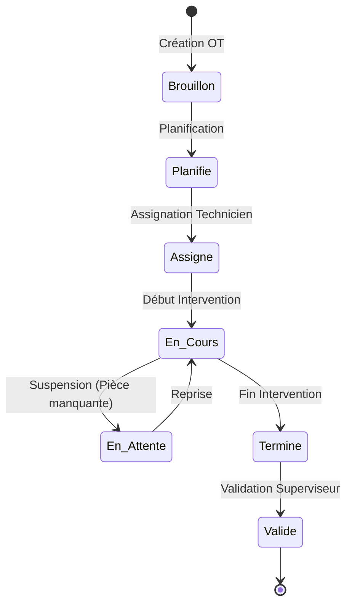
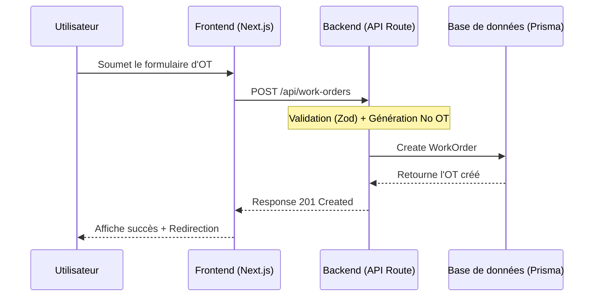
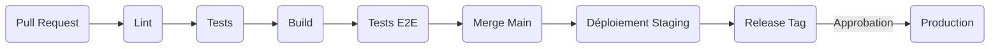

# GMAO Pro — Système de Gestion de Maintenance

**GMAO Pro** est une solution complète de Gestion de Maintenance Assistée par Ordinateur (GMAO / CMMS) conçue pour les installations industrielles algériennes. Plateforme enterprise avec support IoT, analytique avancée, et gestion multi-sites.

---

## Architecture

```mermaid
graph TD
    Client[Client Web] --> Next[Next.js App Router]
    Next --> Components[Composants UI - React/Tailwind]
    Next --> API[API REST]
    API --> Prisma[Prisma ORM]
    Prisma --> DB[(Base de données SQLite/PostgreSQL)]

**Schéma de Base de Données (ERD) :**
```mermaid
erDiagram
    ORGANIZATION ||--o{ SITE : "possède"
    ORGANIZATION ||--o{ USER : "comprend"
    ORGANIZATION ||--o{ ASSET : "gère"
    SITE ||--o{ ASSET : "contient"
    ASSET ||--o{ WORK_ORDER : "maintenance"
    USER ||--o{ WORK_ORDER : "demande/effectue"
    ASSET ||--o{ IOT_SENSOR : "monitoré par"
    IOT_SENSOR ||--o{ SENSOR_READING : "produit"
    WORK_ORDER ||--o{ SPARE_PART_USED : "consomme"
    SPARE_PART ||--o{ SPARE_PART_USED : "utilisé dans"
```
```

---

## Stack Technique

| Couche       | Technologie                                      |
|--------------|--------------------------------------------------|
| Framework    | Next.js 16 (App Router)                         |
| Langage      | TypeScript 5                                    |
| Styling      | Tailwind CSS 4 + shadcn/ui                      |
| Base données | SQLite (dev) / PostgreSQL (prod) via Prisma ORM |
| Charts       | Recharts                                        |
| Tests        | Vitest + React Testing Library + Playwright     |
| CI/CD        | GitHub Actions                                  |

---

## Installation

```bash
# Cloner le dépôt
git clone https://github.com/your-org/gmao-pro.git
cd gmao-pro

# Installer les dépendances
bun install

# Configurer l'environnement
cp .env.example .env

# Initialiser la base de données
bun run db:push
bun run db:seed

# Démarrer le serveur de développement
bun run dev
```

---

## Scripts disponibles

| Commande              | Description                              |
|-----------------------|------------------------------------------|
| `bun run dev`         | Serveur de développement (port 3001)    |
| `bun run build`       | Build production                         |
| `bun run test`        | Tests unitaires (Vitest)                 |
| `bun run test:coverage` | Tests avec rapport de couverture       |
| `bun run test:e2e`    | Tests end-to-end (Playwright)            |
| `bun run db:push`     | Synchroniser le schéma Prisma            |
| `bun run db:seed`     | Charger les données d'exemple            |

---

## Modules fonctionnels

### Gestion des Actifs
- Registre complet des équipements avec arborescence hiérarchique
- Suivi du cycle de vie et historique de maintenance
- Calcul automatique des KPIs : MTBF, MTTR, Disponibilité, OEE
- Gestion des pièces de rechange compatibles par équipement

### Ordres de Travail
- Workflow complet : Création → Planification → Exécution → Validation
- Gestion des priorités P1 (Urgent) à P4 (Faible)
- Suivi SLA avec alertes de dépassement
- Intégration pièces, main-d'œuvre et temps d'arrêt

**Flux de Travail (Workflow) :**


**Flux de création d'un Ordre de Travail :**


### Maintenance Préventive
- Planification par calendrier et par compteur
- Génération automatique des ordres de travail
- Conformité PM avec suivi des KPIs
- Modèles de checklists configurables

### Supervision IoT
- Intégration capteurs en temps réel
- Alertes sur seuils et anomalies
- Tableaux de bord dynamiques
- Analyse prédictive des tendances

### Pièces de Rechange
- Gestion des stocks multi-sites
- Alertes de réapprovisionnement automatiques
- Historique des mouvements de stock
- Liaison équipements / pièces

### Analytique et KPIs

| Indicateur    | Objectif | Formule                        |
|---------------|----------|-------------------------------|
| Disponibilité | > 95%    | MTBF / (MTBF + MTTR)         |
| MTBF          | > 2000h  | Temps total / Nombre de pannes |
| MTTR          | < 4h     | Temps total réparation / Pannes|
| Conformité PM | > 95%    | OTs PM à temps / Total OTs PM  |
| OEE           | > 85%    | Dispo × Performance × Qualité |

---

## Contexte Algérien

- Devise : Dinar Algérien (DZD)
- Découpage géographique : 58 wilayas
- Fournisseurs locaux intégrés (SONAREM, ENIE, SAIDAL, COSIDER, GICA…)
- Réglementation HSE : Décret 88-07, Loi 04-18, normes NA
- Calendrier des jours fériés et horaires de travail locaux

---

## Déploiement

```bash
# Build production
bun run build

# Docker
docker build -t gmao-pro .
docker run -p 3000:3000 gmao-pro
```

### Pipeline CI/CD



---

## Tarification

| Plan           | Prix mensuel | Équipements | Utilisateurs | Fonctionnalités clés          |
|----------------|-------------|-------------|--------------|-------------------------------|
| Starter        | 24 900 DZD  | 200         | 5            | Base, Analytics               |
| Pro            | 59 900 DZD  | 2 000       | 25           | IoT, Analytique avancée, API  |
| Enterprise     | Sur devis   | Illimité    | Illimité     | SSO, Marque blanche, SLA dédié|

---

## Sécurité

- Chiffrement TLS 1.3 en transit
- Chiffrement AES-256 au repos
- Authentification via NextAuth.js
- Isolation multi-tenants
- Audits de sécurité réguliers

---

## Licence

Propriétaire — © 2024 GMAO Pro. Tous droits réservés.

## Contact

- Email : support@gmao-pro.dz
- Documentation : https://docs.gmao-pro.dz
- Statut : https://status.gmao-pro.dz
