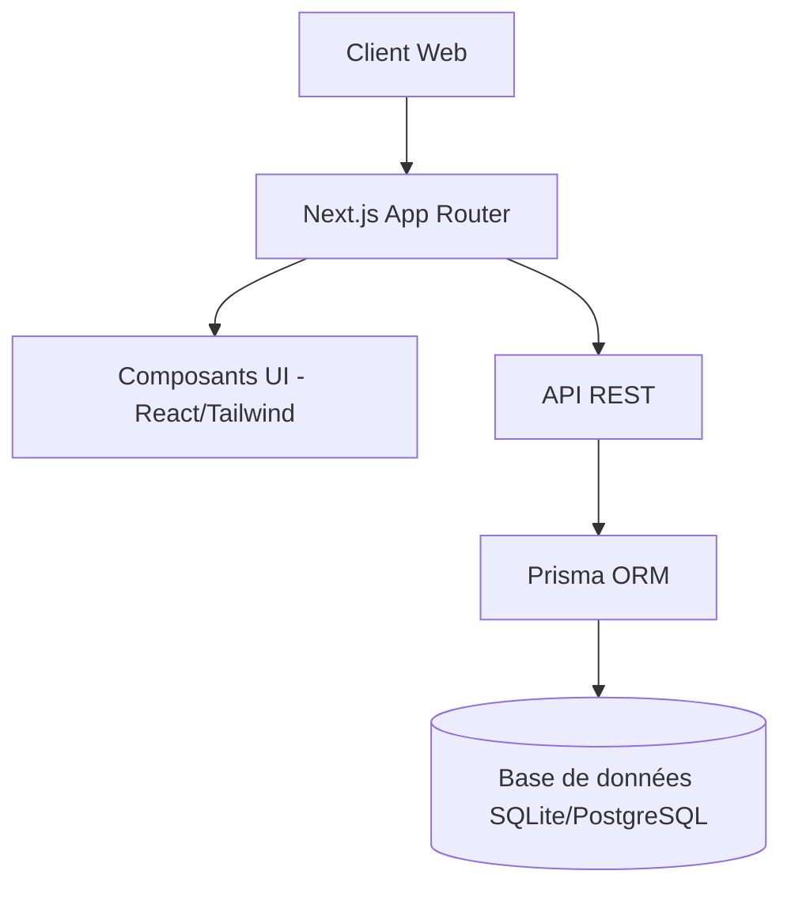
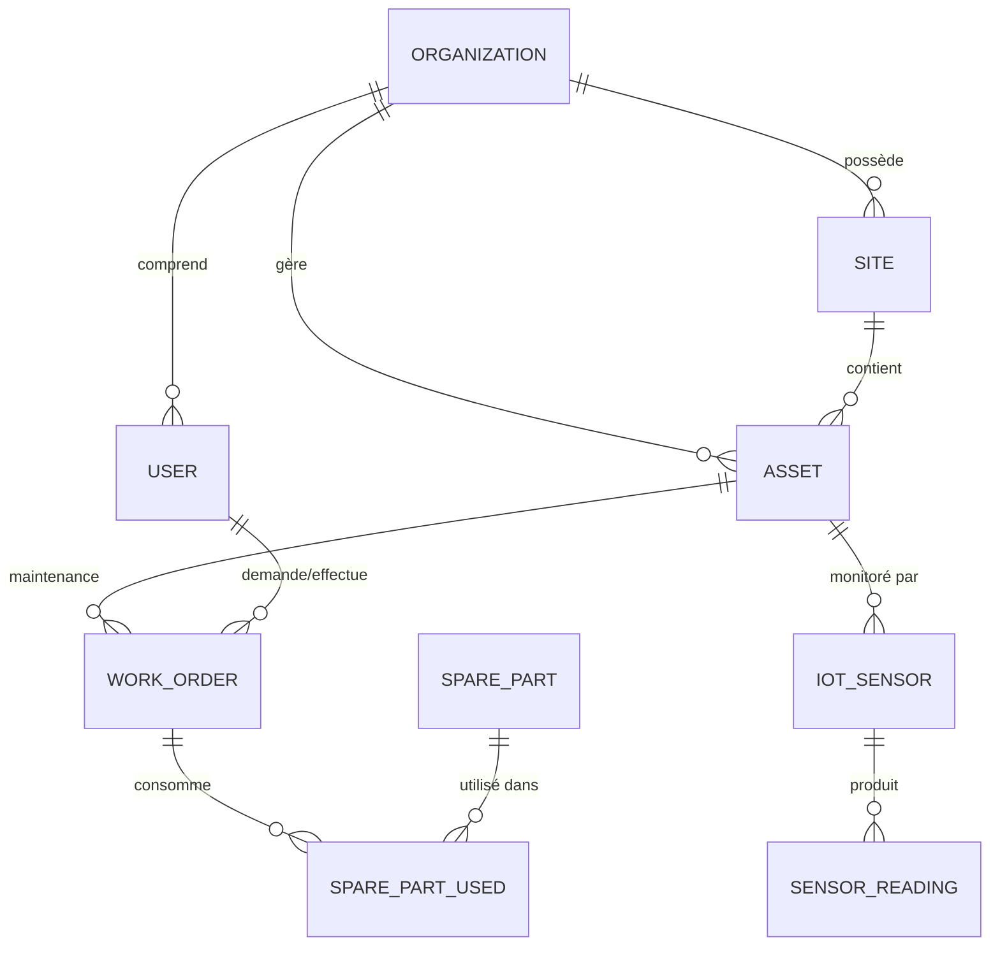
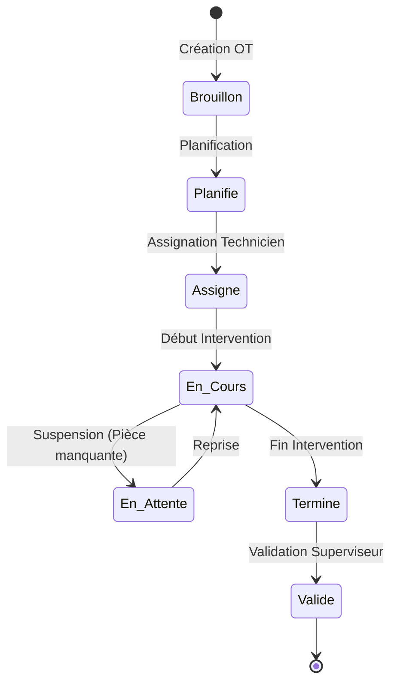
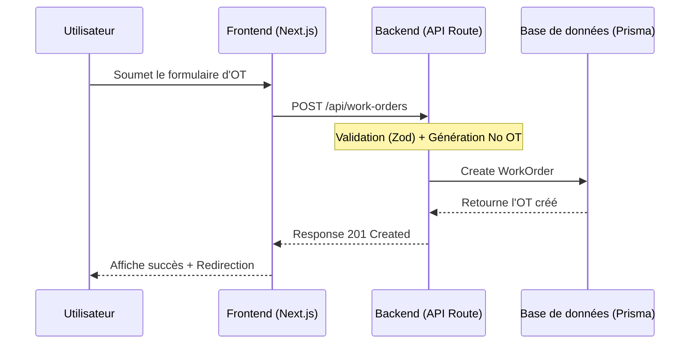
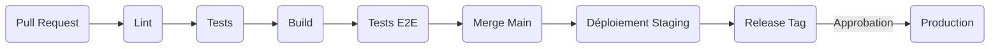

# GMAO Pro — Système de Gestion de Maintenance

**GMAO Pro** est une solution complète de Gestion de Maintenance Assistée par Ordinateur (GMAO / CMMS) conçue pour les installations industrielles algériennes. Plateforme enterprise avec support IoT, analytique avancée, et gestion multi-sites.

---

## Architecture de la Solution

---

## Modèle de Données (ERD)

---

## Flux de Travail des Interventions (Workflows)

### Cycle de vie d'un Ordre de Travail

### Processus de Création d'OT

---

## Tableau de Bord Analytique et Indicateurs (KPIs)

| Indicateur    | Objectif | Formule                        |
|---------------|----------|-------------------------------|
| Disponibilité | > 95%    | MTBF / (MTBF + MTTR)         |
| MTBF          | > 2000h  | Temps total / Nombre de pannes |
| MTTR          | < 4h     | Temps total réparation / Pannes|
| Conformité PM | > 95%    | OTs PM à temps / Total OTs PM  |
| OEE           | > 85%    | Dispo × Performance × Qualité |

---

## Spécifications Techniques

| Composant    | Technologie                                      |
|--------------|--------------------------------------------------|
| Framework    | Next.js 16 (App Router)                         |
| Langage      | TypeScript 5                                    |
| Styling      | Tailwind CSS 4 + shadcn/ui                      |
| Base données | SQLite (dev) / PostgreSQL (prod) via Prisma ORM |
| Graphiques   | Recharts                                        |
| Tests        | Vitest + React Testing Library + Playwright     |

---

## Pipeline CI/CD

---

## Licence

© 2024 **Selma Haci**. Tous droits réservés.
